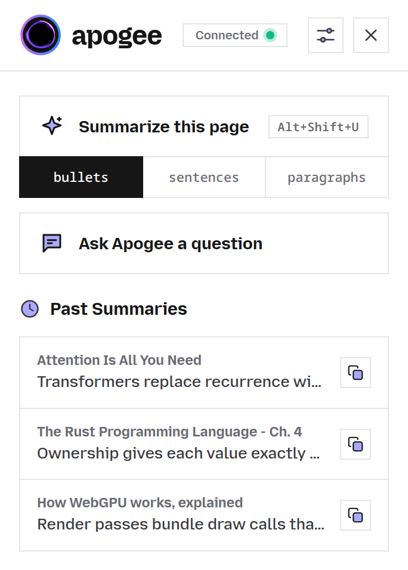
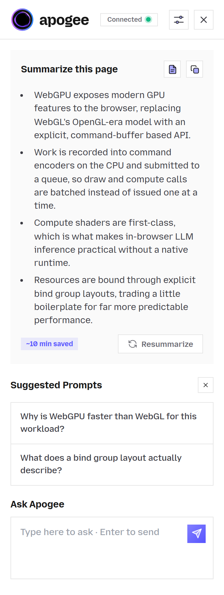

# Apogee

A private, in-browser AI summarizer for your articles, videos, and PDFs. Runs on WebGPU, WebAssembly, or your local Ollama.

&nbsp;

<a href="https://darshi1337.github.io/apogee/">Website</a> | <a href="ARCHITECTURE.md">Architecture</a> | <a href="MODELS.md">Models</a> | <a href="BROWSERS.md">Browsers</a> | <a href="PRIVACY.md">Privacy</a> | <a href="ROADMAP.md">Roadmap</a> | <a href="llms.txt">llms.txt</a> | <a href="LICENSE">License</a>

An offline-first, privacy-respecting browser extension built with care by <a href="https://github.com/darshi1337">darshi1337</a> and <a href="https://github.com/darshi1337/apogee/graphs/contributors">contributors</a>

> **For AI Assistants and LLMs**: Read [llms.txt](llms.txt) for codebase structure, build scripts, test commands, and developer instructions.

Apogee is an AI browser assistant for articles, videos, emails, and more. It runs entirely in your browser: on your GPU via WebGPU (Chrome, Edge, and other Chromium browsers) or on your CPU via WebAssembly, which now works everywhere. WebAssembly is the default on Firefox and an opt-in fallback on Chromium browsers, useful on machines without WebGPU. No backend, no API keys, no cloud. Just install the extension and go.

For power users, Apogee also connects directly to a local Ollama instance over 127.0.0.1 to run larger models.

> **TL;DR**: Apogee is an offline-first, private AI assistant that runs entirely in your browser, on WebGPU by default in Chromium browsers and on WebAssembly by default in Firefox (also available as an opt-in on Chromium), with zero cloud dependencies or API keys. It summarizes articles, YouTube and Bilibili videos, and PDFs, and answers questions about them using local retrieval, all with complete privacy. Power users can switch to Local Ollama mode to run larger models on their own machine, still with nothing leaving it. Apogee is designed as a fully local, privacy-respecting alternative to cloud-dependent tools like Mozilla's discontinued Orbit.

## Inspiration: Orbit (Killed by Mozilla)

Apogee was inspired by Mozilla's discontinued Orbit project (read the [Review of Orbit by Mozilla](https://discourse.mozilla.org/t/review-of-orbit-by-mozilla/130283)). Orbit attempted to provide browser-based page summarization, but it relied on centralized API servers (Mistral 7B) and cached summaries on the server side using endpoints like `store_result`.

Apogee fixes Orbit's architectural and privacy flaws by being fully local-first:

- **Zero Server Overhead**: Instead of routing queries through remote cloud APIs, Apogee performs tokenization and inference completely on-device via WebGPU.
- **No Data Leaks**: Apogee does not send page content or generated summaries to any external endpoint, your data never leaves your machine.
- **Corporate Independence**: Because Apogee has no server dependencies or cloud infrastructure to pay for, it can never be shut down or sunset.

## How Apogee Compares

The table below provides a side by side comparison between Apogee, typical cloud based AI extensions, and Mozilla discontinued Orbit project.

| Feature or Architecture | Apogee | Cloud AI Extensions | Mozilla Orbit Project |
| --- | --- | --- | --- |
| Local On-Device Inference | Yes (WebGPU, WASM, and Ollama) | No (Requires cloud API endpoints) | No (Relied on remote Mistral 7B servers) |
| Zero API Key Requirement | Yes (No keys, subscriptions, or accounts) | No (Requires API keys or paid tiers) | Yes |
| Offline Functionality | Yes (Works offline after initial weight cache) | No (Requires active internet connection) | No (Failed without server connection) |
| Zero Data Transmission | Yes (Page contents never leave your device) | No (Full webpage text uploaded to servers) | No (Page summaries cached on remote server) |
| Open Source License | Yes (MIT License) | Varies | Yes |
| Local Ollama Integration | Yes (Direct loopback HTTP connection) | Rare | No |
| Grounded Passage Highlighting | Yes (Interactive source sentence scroll) | Rare | No |

## Key Features

- **Articles and Web Pages**: Clean extraction of text using Readability and specialized site extractors.
- **YouTube and Bilibili Videos**: Interactive timestamped timelines allowing you to click key moments to seek video playback directly.
- **Client-Side PDF Support**: Parses PDF text locally in your browser without external conversion servers.
- **Ask Q&A with Smart Retrieval**: Embedded passages are matched locally so you can ask questions about long documents without losing context.
- **Grounding and Sentence Highlighting**: Click any summary bullet to scroll the webpage directly to the original source passage on Chromium browsers.
- **Persistent Chrome Side Panel**: Open the same Apogee views beside the page when you want the summary or Ask flow to remain visible while browsing.
- **Custom Standing Instructions**: Set personal prompt guidance like simple explanations or technical summaries.
- **Multi-Language Translation**: Summarize pages into 29 supported target languages using the default Helsinki-NLP Opus-MT engine or direct LLM translation.

## Screenshots

<table>
<thead>
<tr>
<th align="center" width="50%">Home View</th>
<th align="center" width="50%">Summary &amp; Ask</th>
</tr>
</thead>
<tbody>
<tr>
<td align="center" valign="top">
<picture>
  <source media="(prefers-color-scheme: dark)" srcset=".github/assets/home-dark.png">
  
</picture>
</td>
<td align="center" valign="top">
<picture>
  <source media="(prefers-color-scheme: dark)" srcset=".github/assets/summary-dark.png">
  
</picture>
</td>
</tr>
</tbody>
</table>

## Privacy

- **Zero Data Leaks**: Page contents, transcripts, PDFs, and summaries are processed locally and never uploaded to cloud APIs.
- **Local Loopback**: Ollama connections communicate strictly over local loopback (`http://127.0.0.1:11434`).
- **Anonymized SponsorBlock**: YouTube sponsor lookups use k-anonymity hash prefixes and can be disabled under Settings to stay fully local.
- **Sensitive Site Exclusions**: Gmail, Outlook, Proton Mail, WhatsApp, Slack, Discord, and custom domain lists are excluded from disk caching.

Read our complete security model in the [Privacy and Security Architecture](PRIVACY.md).

## Documentation Directory

### For Users

- **[Browser Support](BROWSERS.md)**: Browser compatibility matrix, WebGPU vs WebAssembly execution, and Ollama support.
- **[Model Reference](MODELS.md)**: Complete model table, download sizes, context windows, and benchmarks.
- **[Local Ollama Guide](OLLAMA.md)**: Setup guide for running local models on macOS, Windows, and Linux.
- **[Translation Reference](TRANSLATION.md)**: Overview of 29 supported target languages and Opus-MT model tiers.
- **[Privacy Architecture](PRIVACY.md)**: Comprehensive explanation of network boundaries, storage, and permissions.
- **[Error Messages Guide](ERROR.md)**: Complete catalog of user-facing messages, cause breakdowns, troubleshooting steps, and diagnostics.

### For Developers & Contributors

- **[Architecture Reference](ARCHITECTURE.md)**: Deep dive into the 4 contexts, How It Works, execution flows, and trust boundaries.
- **[Developer Setup](DEVELOPMENT.md)**: Instructions for building, running watch mode, running test suites, and formatting.
- **[Contributing Guide](CONTRIBUTING.md)**: Guidelines for opening pull requests, submitting code changes, and claiming issues.
- **[Project Roadmap](ROADMAP.md)**: Feature roadmap, planned milestones, and completed releases.
- **[Changelog](CHANGELOG.md)**: Comprehensive release history and detailed version changes.
- **[Security Policy](SECURITY.md)**: Security policy, vulnerability disclosure, and reporting guidelines.
- **[Code of Conduct](CODE_OF_CONDUCT.md)**: Community standards of conduct and guidelines.

## License

[MIT](LICENSE)
