# Chrome Web Store listing

Version-controlled copy of the Apogee CWS submission fields. Update alongside each store submission. Version at last edit: 0.2.0.

Packaging: upload a ZIP of the Chromium build (`dist/chrome`), not a CRX. The store repacks and signs it. `npm run package` produces the release ZIP.

---

## Product details

- **Title:** Apogee
- **Summary:** AI browser assistant for articles, videos, emails and more. Runs in-browser via WebGPU, WebAssembly, and Ollama.
- **Category:** Productivity
- **Language:** English (United States)
- **Homepage URL:** https://darshi1337.github.io/apogee/
- **Support URL:** https://github.com/darshi1337/apogee/issues
- **Privacy policy URL:** https://github.com/darshi1337/apogee/blob/main/PRIVACY.md
- **Mature content:** No

### Description

Apogee is a private, in-browser AI assistant for articles, YouTube videos, PDFs, emails, and more. It summarizes what you're reading and answers questions about it, and it does all of this on your own machine. No cloud, no API keys, no account, no telemetry. Your page content never leaves your browser.

WHY APOGEE

Most "AI summarizer" extensions send the page you're reading to a company's servers. Apogee doesn't. It runs quantized language models directly inside your browser, on your GPU via WebGPU or on your CPU via WebAssembly, so the text you summarize is processed locally and discarded. There's nothing to log in to and nothing to leak.

Apogee was inspired by Mozilla's discontinued Orbit project, which offered browser summarization but routed everything through centralized cloud servers. Apogee fixes that by being fully local-first: no server dependency means no data leaks, no subscription, and nothing that can be shut down or sunset.

WHAT IT DOES

• Summarize any page: articles, blog posts, documentation, long threads • Summarize YouTube and Bilibili videos from their transcript, with a "Key moments" timeline of links that seek the video to each moment • Summarize PDFs opened in the browser • Ask questions about the page. Apogee reads the whole page (not just the first few thousand characters) using on-device retrieval, so answers can come from deep inside a long article, PDF, or transcript • Highlight-in-page: click any bullet in a summary and Apogee scrolls to and highlights the passage of the original page it came from, so you can spot-check a claim without re-reading everything • Multiple summary formats: bullets, sentences, or paragraphs, switchable right under the Summarize button • Custom instructions: add your own standing guidance ("Explain like I'm five", "Focus on the technical details") that applies to every summary and answer • Summaries in your language: pick one of 29 output languages (or keep the page's own), translated either by the summarization model itself or, optionally, by dedicated on-device translation models

Fast ways to summarize without opening the popup: • Right-click a page, then "Summarize this page" • Keyboard shortcut (default Alt+Shift+U, remappable at chrome://extensions/shortcuts) A system notification tells you when the summary is ready.

TWO WAYS TO RUN IT

1. In-Browser AI (zero setup) Runs small, fast models entirely in your browser. On first use it downloads the model weights (roughly 270 MB to 2.2 GB depending on the model) and caches them locally. After that, everything works offline. Defaults to WebGPU (WebLLM) on Chrome and Edge, with a WebAssembly (Transformers.js) option in Settings for machines without WebGPU.

2. Local Ollama (for power users) Prefer larger, more capable models? Point Apogee at your own local Ollama instance and it talks to it directly over 127.0.0.1, with no separate backend to install or run. Any model you've pulled shows up automatically. Still fully local; nothing leaves your machine.

PRIVACY

• No cloud inference. Models run on your device • No API keys, no sign-in, no account • No analytics or tracking • Network access is limited to: downloading model weights (from Hugging Face) on first run, and a translation model from the same place if you opt into the dedicated translation engine, your own local Ollama at 127.0.0.1, for YouTube videos the community SponsorBlock API to skip sponsor segments, and for Bilibili videos that site's own subtitle endpoints (api.bilibili.com, hdslb.com) • Page content is processed locally and never uploaded

REQUIREMENTS

• Chrome or Edge 113+ (any recent Chromium browser: Brave, Opera, Vivaldi, Arc, Dia) • A GPU with WebGPU support for the default In-Browser mode (most GPUs from the last several years). No WebGPU? Switch to the WebAssembly option in Settings, or use Local Ollama. • First run downloads model weights, so it needs internet once; after that it runs offline.

OPEN SOURCE

Apogee is free and open source (MIT licensed). Source, issues, and releases: https://github.com/darshi1337/apogee

---

## Single purpose description

Apogee summarizes the web page, video, or PDF the user is currently viewing and answers questions about it, using an AI model that runs entirely on the user's own device: in-browser via WebGPU or WebAssembly, or through a local Ollama instance. Every permission and feature serves this one purpose: on-device summarization and question-answering of the content the user is actively looking at. No content is sent to any remote server.

---

## Permission justifications

**activeTab** Apogee reads the content of the page the user is actively viewing, and only when they explicitly invoke it (toolbar click, right-click menu, or keyboard shortcut), so it can summarize that page or answer questions about it. activeTab grants access to the current tab on user action, avoiding the need for broad host permissions across all sites.

**scripting** On user action, Apogee injects a content script into the active tab to extract the readable text of the page (article body, YouTube transcript, or PDF text) to summarize, and to scroll to and highlight the source passage a given summary line was drawn from. It runs only on the tab the user invoked it on.

**storage** Stores the user's local settings (chosen AI provider and model, summary format, and other preferences) so they persist between sessions. This data stays on the device and is never transmitted.

**offscreen** On Chromium, WebGPU is not accessible from the extension service worker. Apogee uses an offscreen document to run the in-browser AI model (WebLLM on WebGPU, or Transformers.js on WebAssembly) outside any visible tab, so summarization can run in the background without opening a dedicated page.

**unlimitedStorage** In-browser AI model weights are large (roughly 270 MB to 2.2 GB) and are cached locally so they download only once and then run fully offline. unlimitedStorage prevents the browser's default storage quota from evicting these cached model files.

**alarms** Used for reliable background timing under Manifest V3, whose service worker is terminated when idle. Apogee schedules alarms to clean up finished summary streams and to close the idle offscreen AI document after a timeout, work that plain timers would not survive the worker being suspended.

**declarativeNetRequestWithHostAccess** Apogee ships a single static rule that strips the `Origin` header from requests to the user's own Ollama server on `127.0.0.1`/`localhost`, so Ollama accepts them without the user having to configure `OLLAMA_ORIGINS` by hand. The rule is scoped to those loopback hosts, which the extension already has host permissions for; nothing else is modified, blocked, or redirected, and no request on any website is touched.

**contextMenus** Adds a right-click "Summarize this page" menu item so users can trigger summarization directly, without opening the popup.

**notifications** Displays a system notification when a summary requested via keyboard shortcut or context menu is ready, since the popup is typically closed while the model generates.

**Host permission justification** (`http://127.0.0.1/*`, `http://localhost/*`) These loopback host permissions let Apogee connect to the user's own local Ollama server for users who opt into Local Ollama mode, sending requests directly to the model running on their own machine. Only loopback addresses on the user's device are used.

**Host permission justification** (`*://*.bilibili.com/*`, `*://*.hdslb.com/*`) When the user summarizes a Bilibili video, Apogee fetches that video's subtitle track from Bilibili's own API (`api.bilibili.com`) and subtitle CDN (`hdslb.com`) so it can summarize the transcript. Bilibili only serves subtitle URLs to a signed-in session, so this request must carry the user's existing Bilibili cookies; it sends only the video's own IDs and no other browsing information, and the fetched subtitles are summarized on-device and never uploaded. These permissions are used only on Bilibili video pages. Apart from these and the loopback addresses above, Apogee requests no website or third-party host permissions.

---

## Remote code

**No, I am not using Remote code.**

Rationale: the WASM runtimes ship bundled in the package (Transformers.js's WASM is bundled; WebLLM's WASM kernels are downloaded and SHA-256-verified at build time and included in `dist/`, not fetched at runtime). The only runtime downloads are model weight files from Hugging Face, which are data, not JS or Wasm. No `eval`, no external `<script>` tags, no remotely-hosted modules.

---

## Data usage

Check no data-collection boxes. Google defines "collect" as transferring data off the device; Apogee processes all page content locally and transmits none of it. (Reviewers occasionally expect "Website content" to be checked because the extension reads page content. Leaving it unchecked is honest for a local-only tool and is explained by the privacy policy.)

Certify all three disclosures (no selling/transfer, no unrelated use, no creditworthiness use). All true.

---

## Graphic assets checklist

- Store icon: 128x128 PNG
- Screenshots: at least 1, 1280x800 or 640x400, PNG without alpha or JPEG
- Small promo tile (optional): 440x280
- Marquee promo tile (optional): 1400x560

### The images

Every listing image is committed in `.github/assets/`, so what is submitted to each store is the same file that is reviewable here. They were built from HTML and CSS in the same design language as the marketing site (`docs/`): Mozilla Headline and Mozilla Text, `#5855ff` purple, the `#f7f7f7` and `#161616` grounds, the lilac card tints, and the four vertical hairlines.

| File in `.github/assets/` | Size | Used for |
| --- | --- | --- |
| `apogee-deck-1280x800-1..5.png` | 1280x800 | Chrome Web Store screenshots |
| `apogee-deck-2400x1800-1..5.png` | 2400x1800 | Firefox Add-ons screenshots |
| `apogee-promo-tile-440x280.png` | 440x280 | Small promo tile |
| `apogee-marquee-1400x560.png` | 1400x560 | Marquee promo tile |

### The five screenshots

Shown here at 1280x800, the size uploaded to the Chrome Web Store.

**1. Cover.** Headline, one-paragraph pitch, install CTA, and the popup in its default state.

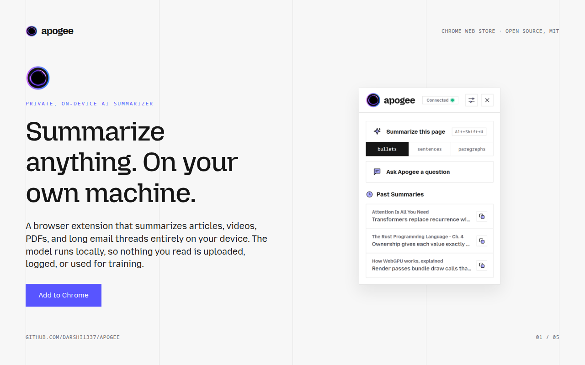

**2. Why apogee.** The usual summarizer versus apogee, side by side, over the strip of supported sites.

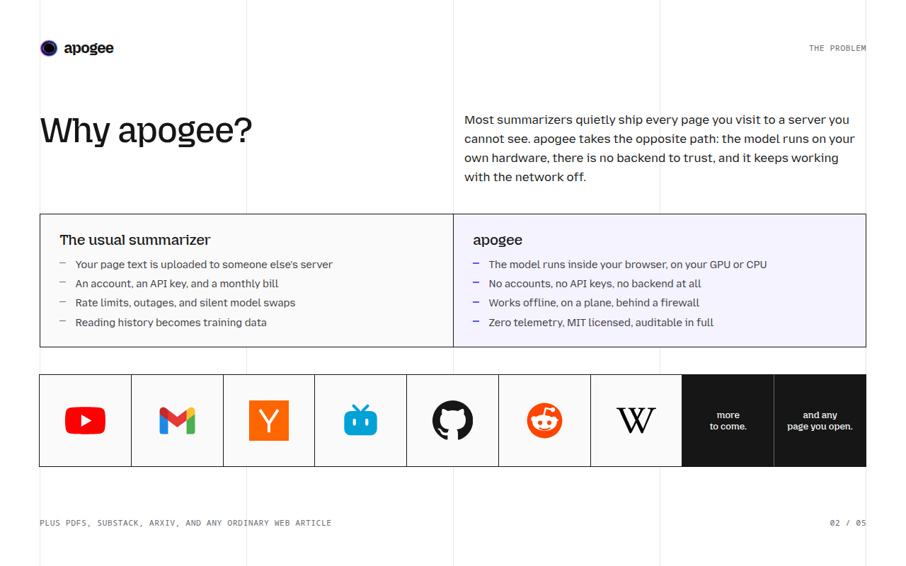

**3. How it works.** WebGPU, WebAssembly, and Ollama, next to a crop of the real AI Provider settings, above the four-step local pipeline.

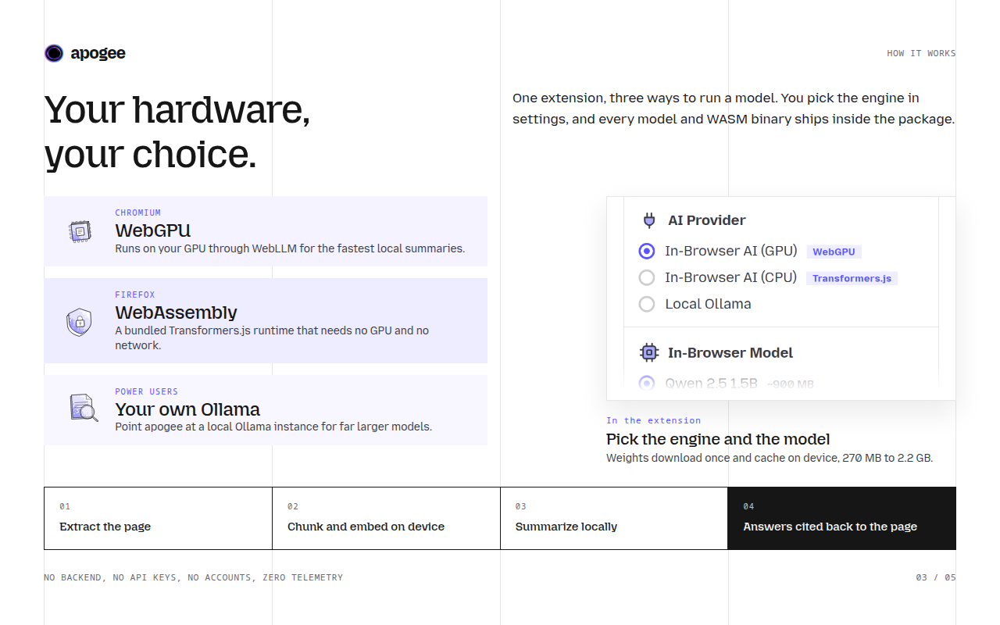

**4. In the browser.** Three cropped screenshots as a numbered flow: trigger the summary, read it, then ask follow-up questions.

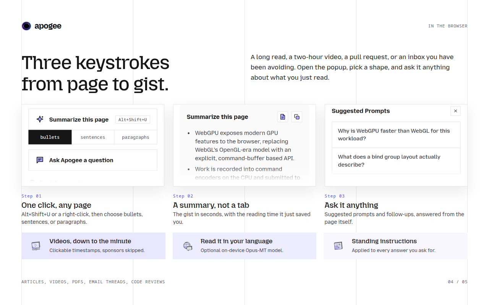

**5. Get started.** Install CTA, the zero servers / 100% on device / MIT stats, and the outlined wordmark.

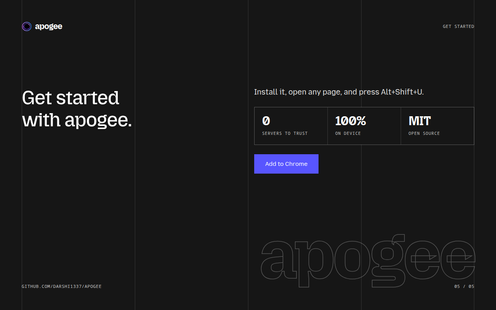

Slide 4 and the cover use crops of the popup captures in `.github/assets`. Crops are done in CSS from the 684px-wide originals via a `--y` offset in source pixels, so re-cropping is a one-number edit rather than an image edit. Each crop fades out at the bottom in the panel's own background color so a cut never lands mid-sentence.

### Promo tiles

Small tile, 440x280. Deliberately text-light, since the tile is often shown small.

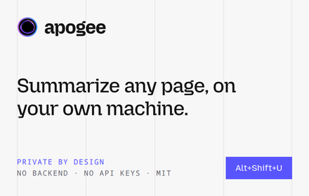

Marquee, 1400x560. The wider canvas has room for the popup alongside the pitch.

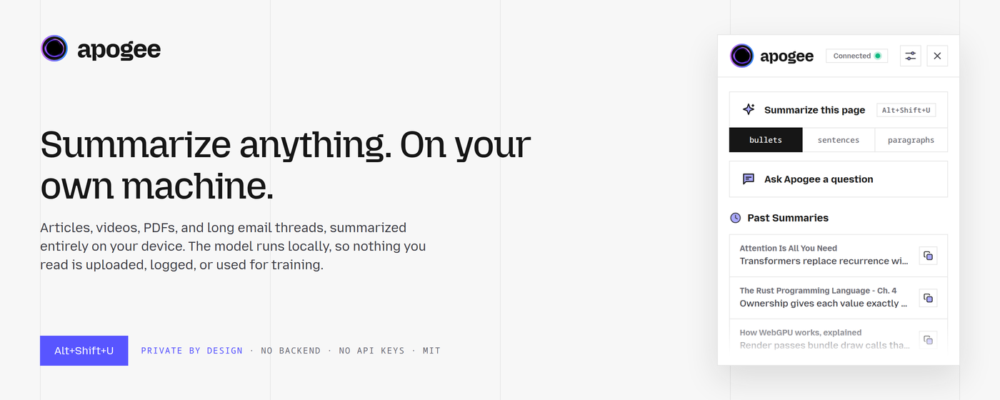

### Firefox Add-ons set

The same five slides at 2400x1800, carrying the Firefox CTA instead of the Chrome one. Uploaded to AMO, not to the Chrome Web Store.

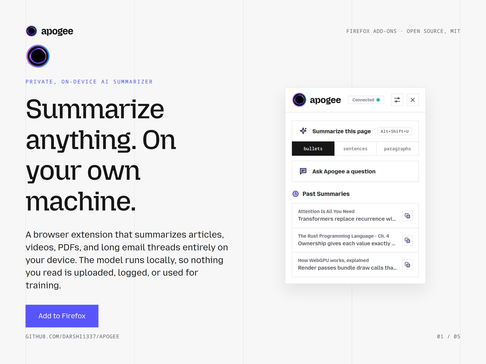

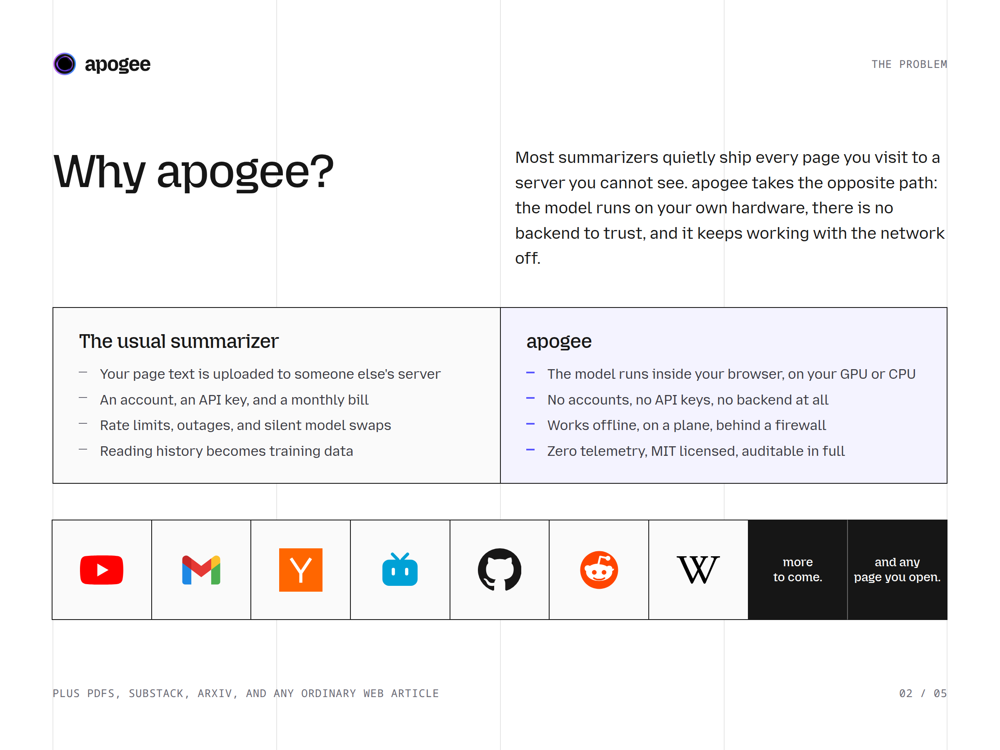

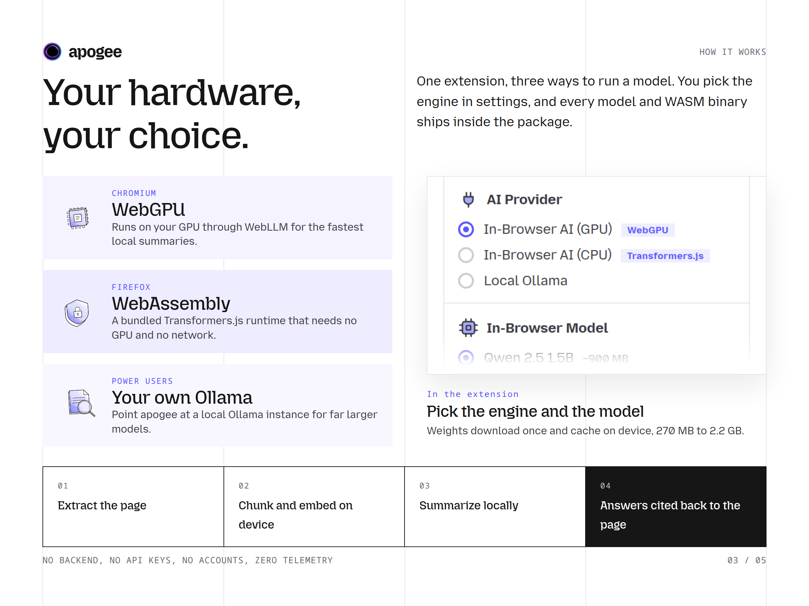

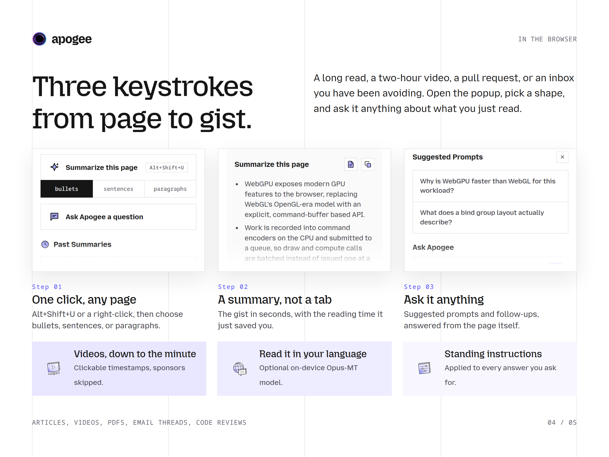

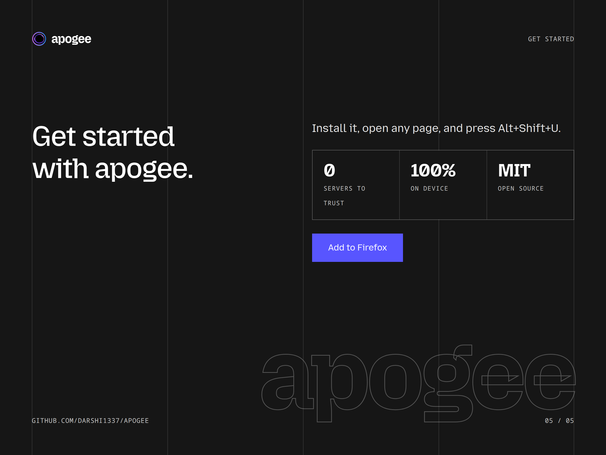

### Notes on the two sizes

One HTML file drives both aspect ratios: `1rem` is tied to `vmin`, so the type scale is identical at 2400x1800 and 1280x800 and only the columns get wider. The 2400x1800 set is captured at 1200x900 with device scale 2 rather than natively, so text renders at 2x.

Each set carries only its own store's install CTA, so the Chrome screenshots never advertise Firefox or the reverse.

Both tiles are captured at 2x and downsampled with Lanczos rather than rendered at 1:1, which is a visible difference in how cleanly the type reads at tile scale.
